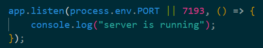
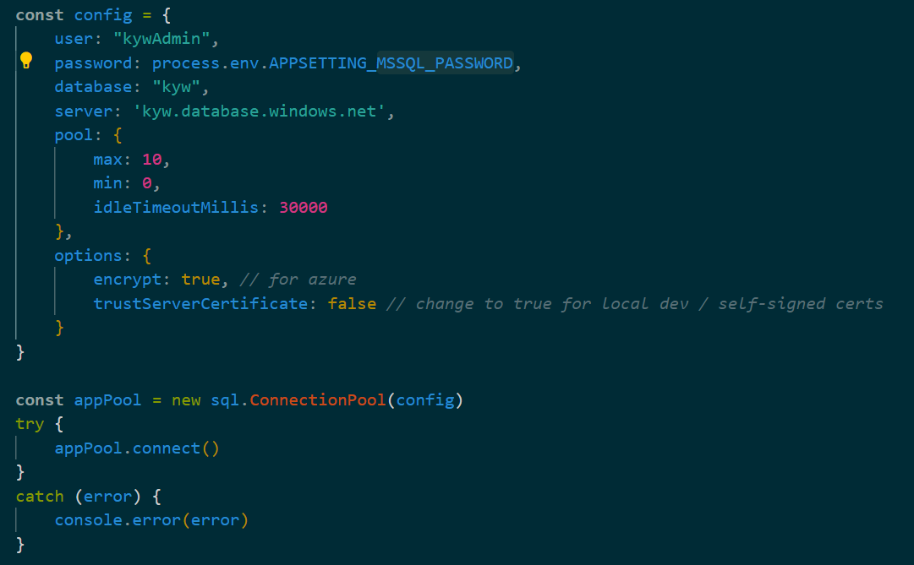
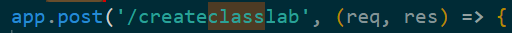
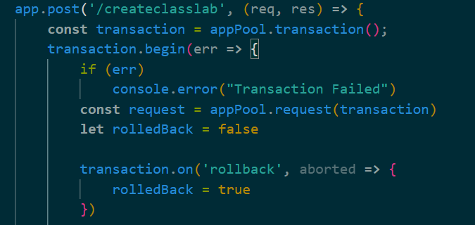
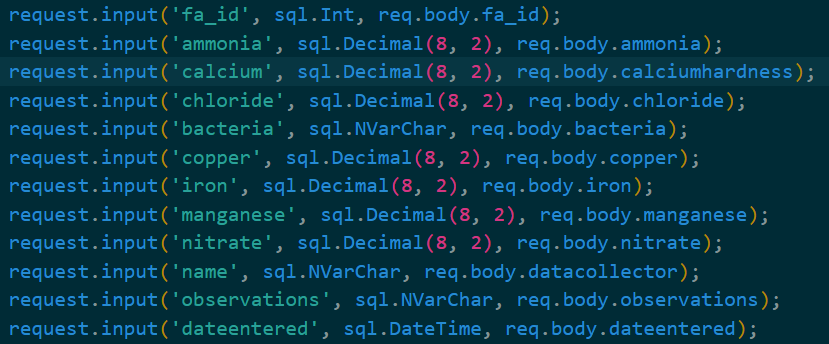
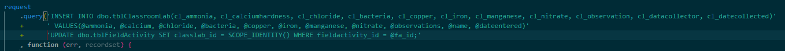
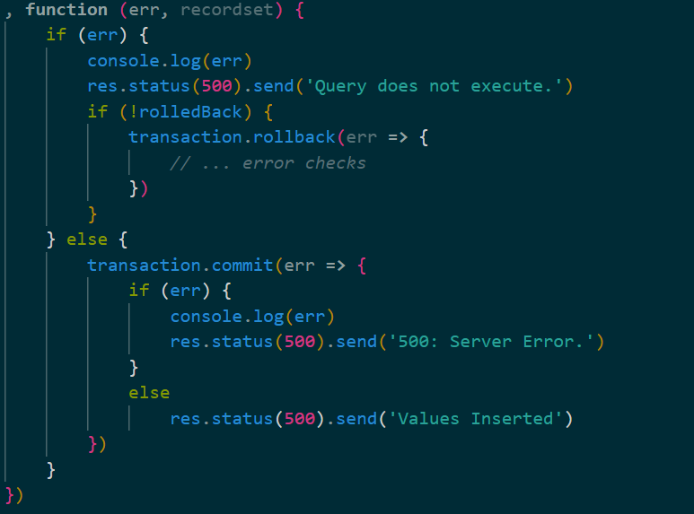
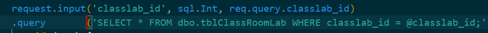
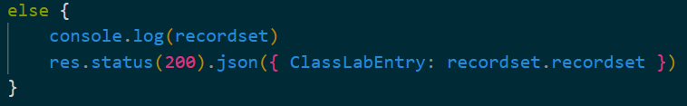

# Backend

## Overview
* The entire app is served through the Node.js backend.
    * Accomplished by configuring project as Node app and serving React front-end using [express.static()](https://expressjs.com/en/starter/static-files.html).
* The app, by default, tries to match the request to an API endpoint using app.get methods; if this fails, it redirects users to static files served using the method mentioned above.
* Connects to database using Express, and [Node MSSQL](https://www.npmjs.com/package/mssql). 
    * Handles requests from the client app to retrieve or update information in the DB.
* Because of these characteristics, the Node backend is divided into roughly three sections:
    1. The portion that listens for incoming requests.
    0. The overall connection to the database.
    0. The get and post functions: that act as our endpoints for database functions.

### Table of Contents
* [Listening for Incoming Requests](#listening-for-incoming-requests)
* [Connection to DB](#connection-to-db)
* [Database Endpoints (Get and Post Functions)](#database-endpoints-get-and-post-functions)
    * [Creating Data](#creating-data)
    * [Reviewing Data](#reviewing-data)

## Listening for Incoming Requests
app.listen() listens on a specified port for connections coming to our domain. The only thing worth noting for our specific implementation of app.listen() is that our value for the port argument can be process.env.PORT or 7193. process.env.PORT is Node's method of accessing Azure's PORT [environment variable](https://learn.microsoft.com/en-us/azure/app-service/reference-app-settings?tabs=kudu%2Cdotnet) if it can't be found (as is the case with local development), then 7193 is the default fall-back.
  

## Connection to DB
The config object comprises several important pieces of information needed to create the DB pool. One important note is that the password is accessed by using an environment variable. You can find this environment variable by adding it to the Azure configuration settings with the key being the value that follows "APP_SETTING_" in this case, "MSSQL_PASSWORD." The portion outside of the config object encompasses creating an [appPool](https://github.com/tediousjs/node-mssql#connection-pools) and then connecting it.
   

## Database Endpoints (Get and Post Functions)
As stated in the overview, the Node app, by default, attempts to match incoming requests to app.get or app.post functions that correspond to different DB-related tasks (creating, and reviewing data.) The app matches this by checking the path that follows the domain name and attempting to match it to one of our methods. In the case of the example given below:  
The URL that would trigger the method would be the domain name plus the first argument of the post function (/createclasslab), i.e. https://knowyourwell.azurewebsites.net/createclasslab. The app tries to match the request to all of the .get and .post methods in the order that they are defined in index.js. If it fails to match to any of these methods the default get method executes.  
It sends the file index.html that was first accessed in the app.use(express.static(wwwroot)) to the user's browser. index.html does very little besides running our React code; which when deployed, is one large .js file. 

### Creating Data
One of two types of DB endpoints: they broadly use the following process to insert data into the DB. The first step of executing the insertion step is creating the [transaction](https://github.com/tediousjs/node-mssql#transaction) that ensures all relevant requests are executed in one connection from the global connection pool. After the initial error check, the transaction waits for an aborted signal indicating that the transaction failed. Finally, a request is created, which is the actual structure that executes the relevant SQL query.
 
The next step of the process is to process user inputs, which come from the front-end in the body of the Axios request. To prevent SQL injection attacks, we use [request.input](https://www.npmjs.com/package/mssql#sql-injection) to sanitize user inputs from req.body. Finally, the inputted parameters are used as the values in the SQL query. Both steps of the process can be seen below. 
 
*User input in request body put into parameters*
 
*Query is executed with inputted parameters.*
If this query is not correctly formatted, it sends the failed status back to the requesting page and rolls back the transaction if it isn't already; otherwise, it attempts to commit the transaction, again sending that the transaction failed if an err is thrown. Otherwise, a 200 status is sent along with a message informing the requesting page that the values had been successfully inserted.
 

### Reviewing Data
Reviewing data is very similar to creating data with two exceptions.
1. The user inputs are used in the WHERE clause of the SQL query.
0. The information sent back to the user includes the DB's response as well as the execution code.
Both of these adjustments can be seen in the pictures below.
 
*User input parameterized and used in WHERE clause.*
 
*Instead of only sending a message that tells the page that the values have been inserted, the results of the query are returned*
