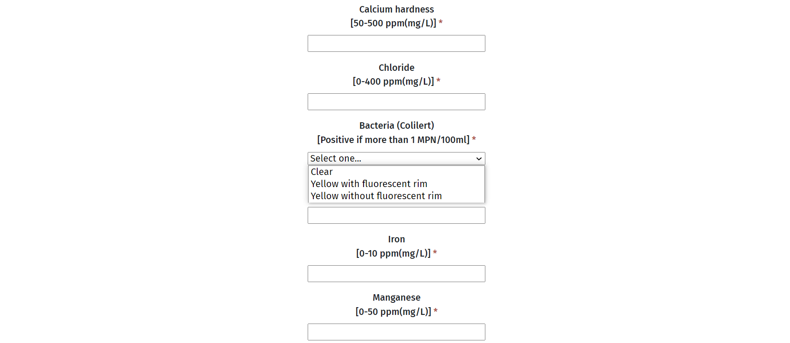
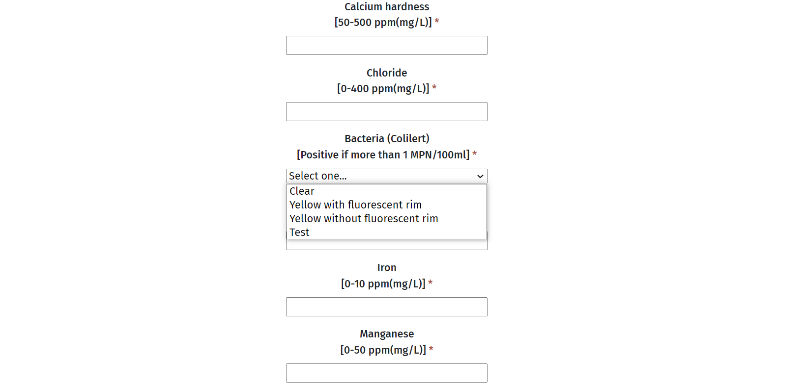

# Common Tasks
This section has an overview of several common tasks that might be peformed as part of routine maitenance/expansion of the app.

## Connecting to the DB.
The following information will be useful for accessing the DB.
* User: kywAdmin
* Server Name: kyw.database.windows.net
* Database: kyw
* MSSQL_PASSWORD: Can be found as an Application Setting under Configuration in the Web App's Azure page.
There are two ways to connect to the DB.
1. Using the Azure portal:
    * In the [Azure portal](https://portal.azure.com/) go to the kyw SQL database.
    * In the search bar on the left hand side of the screen type in "Query Editor."
    * Use the User and MSSQL_PASSWORD values mentioned above to access the page.
    * From here you can see or edit the data by right-clicking on the appropriate table and selecting the your preferred option.
0. Using MSSQL Management Studio
    * If applicable [download MSSQL Management Studio](https://learn.microsoft.com/en-us/sql/ssms/download-sql-server-management-studio-ssms?view=sql-server-ver16)
    * After opening MSSQL use the following values.
        * Server Type: Database Engine
        * Server Name: Server Name.
        * Authentication: SQL Server Authentication
        * Login: User
        * Password: MSSQL_PASSWORD.
    * To find the relevant DB expand the Databases folder in the panel on the left-hand side of the screen and then expand the kyw database section.

## Making Minor Adjustments to the Code
This guide is for minor adjustments to the source code (1-20 lines.) Any adjustments larger than this or edits that adjust the larger structure of the website should be performed by people who have experience with web development, and the tools required to do it.
1. If you don't have one, [Create a GitHub account](https://docs.github.com/en/get-started/signing-up-for-github/signing-up-for-a-new-github-account). This is the account you will use to access and edit the code in you web browser.
0. Have the owner grant you access to the GitHub repository. If there is any confusion about how to do this, this [article](https://docs.github.com/en/account-and-profile/setting-up-and-managing-your-personal-account-on-github/managing-access-to-your-personal-repositories/inviting-collaborators-to-a-personal-repository) is helpful.
0. Many changes can be made simply by [editing files directly on GitHub](https://docs.github.com/en/repositories/working-with-files/managing-files/editing-files) if you anticipate making very signifigant changes to the source  hand off the task to someone who knows how to edit and test the code locally. 


## Adding or Deleting Drop-Down Items
This process is quite trivial as long as you have access to the source code.
1. Access the .js file in knowyourwell\knowyourwell\ClientApp\src\components that contains the dropdown you would like to edit. For the purposes of this demonstration I will be using the bacteria dropdown in classlab.js which looked like this before modification .
0. After finding the relevant file the next step is finding the relevant [HTML select element](https://developer.mozilla.org/en-US/docs/Web/HTML/Element/select). This can be done by using (Ctrl/CMD+f)  and then typing in select into the relevant box. Press enter until you find the section of the .js file that has options that match up to  the existing drop-down elements. An example of what this section looks like for the bacteria drop-down is provided below.  *Notice how the various [option elements](https://developer.mozilla.org/en-US/docs/Web/HTML/Element/option) correspond to the menu choices shown in the previous screen-shot*
0. To add an additional option to the drop-down we follow the template followed by the other option elements that are valid choices in my case I selected the last option element: ```<option value="Yellow_without_fluorescent" id="bacteria" name="bacteria" required >Yellow without fluorescent rim</option>``` this can be done by copy and pasting the element on a new-line immediately beneath itself.
0. We then adjust the [value attribute](https://www.w3schools.com/html/html_elements.asp), and the [content](https://www.w3schools.com/html/html_elements.asp) of the option element that we copied. In my example I have adjusted the value and content both to Test. My modifications can be seen below. ![Modified Select Element(DocumentationImages/modifiedSelect.png "Modified Select Element")
0. The final result can be seen below 