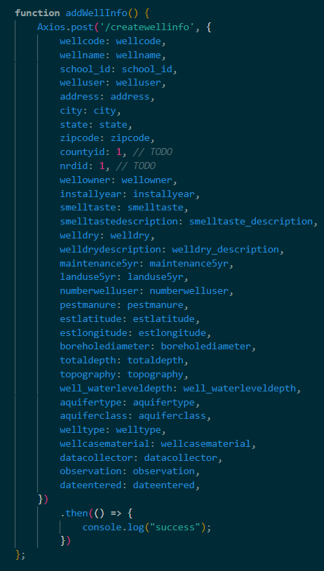
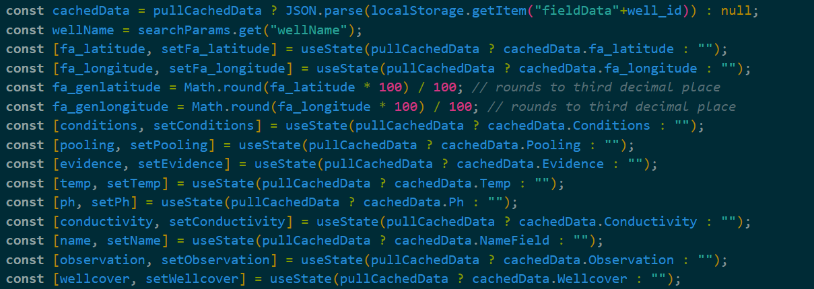
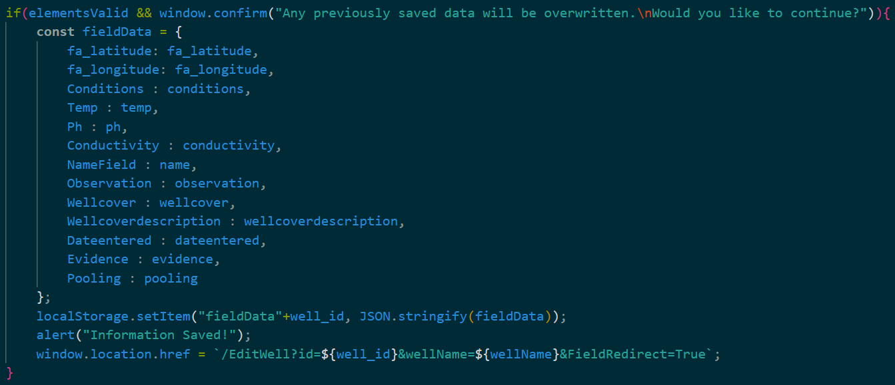
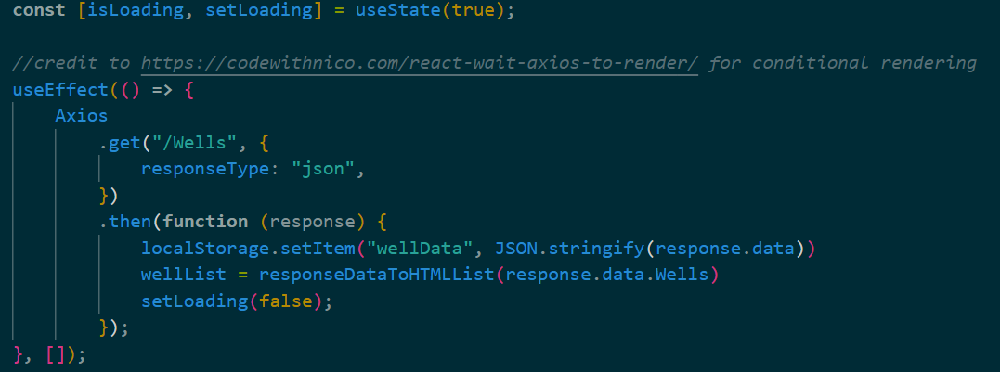

# Front End

### Table of Contents

- [Overview](#overview)
- [Form Pages](#form-pages)
  - [Caching Form Data](#caching-form-data)
- [Menu Pages](#menu-pages)
- [Viewing Pages](#viewing-pages)

## Overview

- Served by the Node Backend if the request doesn't match any of the DB API endpoints.
- Broadly
  - Takes processed information from the Node backend and displays it.
  - Collects information from users both by them entering it explicitly, and by reading system information e.g., drop-down menu, and system time.
    - Validation is also performed using [HTML pattern attributes](https://developer.mozilla.org/en-US/docs/Web/HTML/Attributes/pattern) in the relevant forms.
  - Sends information collected by users to the server app using [Axios](https://axios-http.com/docs/intro).
- Organized by the major points where the app is used with menus to navigate between these sections.

  - Well Info &#8211; General information about the well.
    - Designed to be usable without internet access.
  - Field &#8211; Collecting information in the field.
    - Designed to be usable without internet access.
  - Lab &#8211; Students input results of lab tests that they run on water samples.
    - Similar to Well-Info, except the user selects the well log they want to update for the Lab section.
    - Associated with a Field entry
  - Image &#8211; Students may take or upload a picture of certain features or documents associated with a well.
    - Designed to be usable without internet access.

  _Note: Information submitted while offline (where supported) will be added to an upload queue that checks for an internet connection ever 15 seconds. If a connection is found, data is uploaded automatically._

To accomplish the tasks described above: pages in the Frontend are broadly separated into three categories: menus pages, form pages (for entering data), and pages for displaying data.

## Form Pages

As mentioned before, form pages are used to enter data and can be seperated according to the task they are used to complete, i.e., creating a new well, creating field entry, entering data for class lab, and uploading images. Each of these pages can be divided into two sections: the form itself and the code used to submit the data to the Node backend.

The form itself is usually lengthy and complex, but documentation for [React forms](https://www.w3schools.com/react/react_forms.asp) already exists in a form far better than I could provide. That being said, a few features of the forms are important for how the data is sent to the Node backend. First, we initialize the values that will be eventually be sent to the backend, along with the method used to change them using a [useState hook](https://www.w3schools.com/react/react_usestate.asp). An example of the city from wellinfo can be found below:
    
The form can be generally characterized as a collection of [HTML input elements](https://developer.mozilla.org/en-US/docs/Web/HTML/Element/input) that ,when changed, invoke the method used to update its variable's value as seen below for the same variable.
    
Frontend validation of this data is performed using the pattern attribute. Once the user has decided they want to submit their values and hit the submit button, a function is called that first checks the validity of the form and confirms if the user would like to submit the data. If both these checks are successful, the data is submitted using a function specifically meant to do this in my example addWellInfo(). This function uses an Axios.post() request to send the data to the appropriate backend end-point (more details on backend endpoints can be found in [Backend.md](/Backend.md).) In this Axios.post request the data values as they were when the last update method was called are sent in the request's body. An example can be found below.
    

### Caching Form Data

Some forms can save data either because the users might not want to enter it all at once or because the data might be entered in an area with no internet connection. In this case, the first thing that happens when the page is loaded is that the page performs a check to see if there is any saved data. If this check finds saved data, the page asks the user if they would like to load the data. This workflow significantly modifies the process of initializing the variables. An example from field.js can be seen below.
    
In this case, cachedData is initialized with a [ternary operator](https://developer.mozilla.org/en-US/docs/Web/JavaScript/Reference/Operators/Conditional_operator) based on whether the user decided to continue their previous session. If they did cachedData is set to the information retrieved from localStorage otherwise, it is set to null. The other initializations proceed similarly, only this time the value is set to the appropriate property of the cachedData object, e.g., cachedData.Ph for ph. The workflow for saving data is a modified version of the final data submission. The main modifications are that the elements are either valid or empty; which can be seen in the initial loop in cacheFieldForm() that defines the value of elementsValid. The second modification is that the values, instead of being put in the body of an Axios.post request, are encoded in a JS object that is then stored in localStorage with a key that matches the one used later to retrieve it, if necesarry. An example of object creation and saving can be found below.
    

### Automatic Offline Data Upload

On forms that support it (Well Info, Field, and Image), when the user clicks the "Submit" button while they do not have a connection to the server, the app will instead place the data in a queue that will periodically check for a connection and, if one is found, attempt to automatically upload the data. When the app attempts to upload this data, it will keep track of which requests succeed and which requests fail, and will only remove data from the queue if the upload succeeds. In the case that not all data successfully uploads, the app will prompt the user informing them of such, and will try again the next time a connection is established; if all data uploads without issue, the app will inform the user of such.

## Menu Pages

Menu pages serve as our primary method of navigation. These menus are primarily created using [Bootstrap buttons](https://getbootstrap.com/docs/4.0/components/buttons/) that are links to the appropriate pages. To display buttons that are relevant to specific users, we use conditional rendering based on whether the backend has sent the data that is needed. An example of this process from well.js is provided below.
    
In the first line isLoading is initialized very similarly to the variables mentioned above in the forms section with a default value of true to represent that the page starts with a call to the backend. After the Axios request executes and the data is returned, the new data is stored in localStorage and is then processed into a form that can be returned to the user's browser (a list of Bootstrap buttons), and isLoading is set to false. However, since there is no guarantee when, if ever, the DB will return the values if isLoading is true, the page will first try to process and display data cached as a result of previous Axios requests or simply return the default Create Well button if none can be found. If isLoading is set to false, the processed data from the DB is returned.

## Viewing Pages

Most viewing pages use a simplified version of the conditional rendering process described above. They perform a call to the appropriate backend method, return a Loading message if the call hasn't been completed, and process and return the data from the completed Axios request. The exception to this rule is viewing wellinfo, which pulls from the wellData saved on the Wells.js page.
