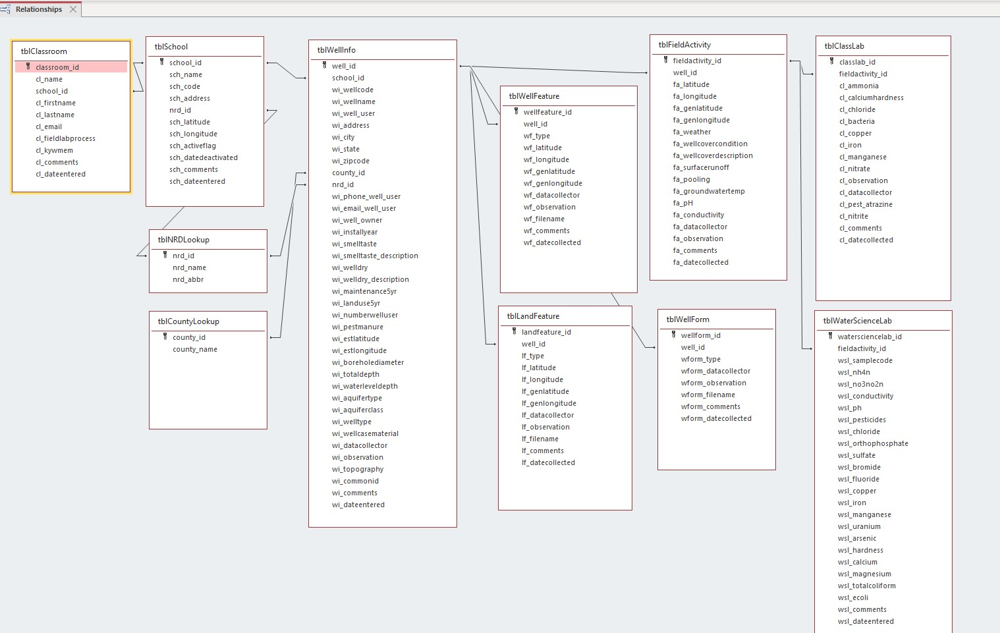

# know-your-well

2024-2025 Nebraska Water Center Senior Design Capstone Project

[Know Your Well YouTube Channel](https://www.youtube.com/@knowyourwell3985)

### Table of Contents

- [Executive Summary](#executive-summary)
- [Introduction](#introduction)
  - [Operational Environment](#operational-environment)
  - [Intended Users and Uses](#intended-users-and-uses)
  - [Assumptions and Limitations](#assumptions-and-limitations)
  - [Ethical Considerations](#ethical-considerations)
- [Past Design](#past-design)
- [Important Features](#important-features)
  - [Geolocation](#geolocation)
  - [Offline Caching](#offline-caching)
  - [Input Validation](#input-validation)
  - [Authentication](#authentication)
- [Architecture](#architecture)
  - [Database](#data-base)
  - [Node Backend](#node-backend)
  - [React Frontend](#react-frontend)
- [Next Steps](#next-steps)
  - [Notable At Large Bugs](#notable-at-large-bugs)
  - [Agile Epic Level Issues](#agile-epic-level-issues)

## Executive Summary

[Know Your Well](https://knowyourwell.unl.edu/ "Know Your Well") (KYW) is a project started at the University of Nebraska affiliated Nebraska Water Center (referred to as "the sponsor") that engages high school students and teachers in sampling and testing groundwater quality. About 160 students from 19 schools participated in KYW Phase 1 from 2017 to 2019. Through KYW, students are trained in well construction, features affecting well water quality, and how to collect and test samples. While sampling, students use a Progressive Web Application (PWA) to record well coordinates, land use, and other relevant well features, laying the groundwork for understanding groundwater vulnerability.

## Introduction

This application allows users (students or teachers generally) to log in using a secure single sign-on protocol through the Nebraska Department of Education’s NebraskaCloud federation. They can then create wells in the app that are submitted to an azure database. These wells are viewable to all students and teachers of the same school. These wells are viewable in the form of a list or a geographic map interface. Images associated with the well can also be uploaded. Students in the KYW program can go to the well and submit "field activities" through the app. Upon returning to the classroom for the testing of the water samples that are collected, students create "class labs" and "water science labs" associated with respective field activities and submit the testing results to the database.

### Operational Environment

There are two operational environments in which the app will be used: in the classroom and at the well itself. In the classroom, students will have access to general information about the well as well as any associated images, and later, classroom lab and water science lab test results. At the well, which is typically a remote environment where internet access is limited or non-existent, the app is typically used on mobile devices such as tablets. The most crucial difference between these two environments is that the classroom is likely to have a stable internet connection, whereas the well’s location may not have a stable connection, if at all, to the internet.

### Intended Users and Uses

High school students from participating Nebraska high schools will be the primary users of this application. Additional users include the UNL Water Sciences Lab, the Nebraska Water Center, the Daugherty Water for Food Global Institute at the University of Nebraska and other miscellaneous staff or faculty within the University's College of Agricultural Sciences and Natural Resources. The main use of this PWA is to replace documentation of information about wells, field activities, class labs, and water science labs done using paper and pencil. Another use of the PWA is to benefit from functionality that would be unfeasible on paper and pencil, such as by uploading images associated with a particular well.

### Assumptions and Limitations

The first assumption is that students will use an electronic device they have access to, such as a phone, tablet, or a laptop. Another assumption is that every student will have access to a device, whether their own or provided by their school.

One limitation is that the user must have internet access in the location that they initially boot up the app. It uses a secure single sign-on protocol through the Nebraska Department of Education’s NebraskaCloud federation, which requires an internet connection to authenticate. Another potential limitation is if the student is unable to gain access to a device at the time of data collection, they may not be able gather all the required data.

### Ethical Considerations

There are a few ethical considerations to be made in the production of Know Your Well. First, we must ensure that students gain the well owner’s consent before going on to their property to test their well. In Nebraska, wells are private property and require owner consent for students to enter the physical area to perform cataloguing. This is traditionally handled by external storage of a consent form provided by the well’s owner, but as part of image storage features, this form can now be stored within the PWA's database.

Also, we want to protect the anonymity of the students, wells, and well owners. This app also retains potentially sensitive information such as the full names of individuals, geographic coordinates of wells, and free-form text that may include unexpected and potentially sensitive data. The team’s photo upload features are now in production, meaning the app will also store user-submitted images which likewise may present unexpected and potentially sensitive data. The introduction of the geographic map interface shows the location of a well on a map; to maintain owner privacy, the level of zoom on the map has been limited to obscure the exact location, and well details are not displayed from this page.

In summary, privacy and consent are our two biggest ethical concerns.

## Past Design

As this is a continuation project, with our group being the third team to work on it, we received a product that had a preexisting design. The previous version of the app was contained in this same repository and had the same architecture as the current version, but it was more primitive in functionality. In the previous version of the app, users could create wells and input information related to research, classroom labs, and field activities.

## Important Features

### Geolocation

Geolocation was a feature that the sponsor mentioned on day one of the project as one of an app's major benefits. The main way geolocation would be used in the finished product is by easily identifying the coordinates of the well as well as important features. We have successfully implemented geolocation across the app. When the app is opened, it will use [navigator.geolocation.getCurrentPosition()](https://developer.mozilla.org/en-US/docs/Web/API/Geolocation/getCurrentPosition) to get the user's current position and store it using [React Context](https://react.dev/reference/react/useContext) so that it can be used from anywhere in the app. Currently, the app will first get the user's position once upon it being opened, before the user tries to use geolocation, to establish a fallback cached value. From then on, any time the user attempts to use geolocation, the app will attempt to update this value, and if it cannot it will use the most recent value it obtained.

## Offline Caching

Offline caching is the most important feature of the application. This is because as previously stated, the sponsor anticipates that many field locations won't have a stable internet connection. To counteract this the app must be able to save the information they need for their field activity. There are two different types of offline caching supported by the app:

1. Manual Caching: When the user knows they do not have a connection, or wants to cache their data to come back and edit later, they can press the "Save" button on supported forms. When the user navigates back to the page and cached data exists, the app will prompt the user to ask if they would like to continue with their cached data. This is implemented using localStorage to save the relevant data.

2. Automatic Caching: When the user attempts to submit data, if the app does not have a connection to the server it will automatically cache the data in a queue that will check for a connection every 15 seconds and, if one is found, upload the user's data. This is implemented using localStorage to store form data and IndexedDB to store images.

### Input Validation

Input validation is currently handled by string patterns in the forms on the pages. These string patterns enforce constraints on the field such that users can not input values outside of a certain range.

### CSV Exporting

An export page exists in the app that allows users to export data about wells they have access to. This page can be accessed from the navigation bar once the user is logged in. There are currently two supporteed data export options: All Well Data and Image Metadata.

### Sorting/Filtering Wells

Wells can be sorted and filtered using the two buttons at the top of the wells page. Options for sorting and filtering are listed below:

- **Sort**
  - Oldest First (default)
  - Newest First
  - Well Name A-Z
  - Well Name Z-A
  - Most Recent Field Activity
- **Filter**
  - County
  - Natural Resource District
  - Search (By Well Name)
  - Latitude Range
  - Longitude Range
  - Wells in a \_\_\_ mile radius

### Authentication

Authentication has been completed in the form of Nebraska Cloud. Currently, the login page sends an api request to the backend server (index.js) and a SAML 2.0 login request is created by utilizing the samlify library. After a SAML URL has been generated, the app is redirected to the Nebraska Cloud website where users are to submit their school email and passwords to login. The users are then redirected back to the well page after the response from Nebraska Cloud has been received and a user session has been created. At the wells page, the app uses the information returned from Nebraska Cloud to determine the users school and then only wells from that school are displayed.

Authenticating users was a big step. This is because all wells that are created within in the app must be linked to their school, and Nebraska Cloud allowed us to do just this. In the current app, users can only see wells that are created by those who attend the same school, which was a sponsor requirement.

### Image Upload

The application includes the funcionality for uploading images of various land features such as septic tanks, surface water, and well heads, as well as important documentation like the well owner's consent forms and image release consent forms. Images can be captured and uploaded to the database from the user's device any time after the well has been added to the database. The images are designed to be viewable in the Previously Uploaded Images page. Like field data, images can be captured offline and will automatically upload to the database when the user has internet access.

## Architecture

### Data Base

_Major adjustments to this database have been made as per the sponsors request. Several fields were added, the class lab and field relationship was reworked, and a land feature table was added._

The database that the PWA connects to is a SQL Database hosted on the sponsor's Azure account. It has a series of tables that correspond to user-associated information and tables associated with each of the three contexts where the app is used (classroom/home for well info, remote site for well, and classroom for the class lab.) The sponsor also included a Nebraska Water Center lab table which is for an anticipated expansion of the app to be used to enter data that will come from their experiments.

### Node Backend

_More in-depth information can be found in [Backend.md](/Backend.md)_

- The entire app is served through the Node.js backend.
  - Accomplished by configuring project as Node app, and serving React front-end using [express.static()](https://expressjs.com/en/starter/static-files.html).
- The app by default tries to match the request to an API endpoint using app.get methods if it fails to do this it redirects users to static files served using the method mentioned above.
- Connects to database using Express, and [Node MSSQL](https://www.npmjs.com/package/mssql).
  - Handles requests from the client app to retrieve, or update information in the DB.

### React Frontend

_More in-depth information can be found in [Frontend.md](/Frontend.md)_

- Served by the Node Backend if the request doesn't match any of the DB API endpoints.
- Broadly
  - Takes processed information from the Node backend and displays it.
  - Collects information from users both by them entering it explicitly, and by reading system information e.g., drop-down menu, and system time.
    - Validation is also performed using [HTML pattern attributes](https://developer.mozilla.org/en-US/docs/Web/HTML/Attributes/pattern) in the relevant forms.
  - Sends information collected by users to the server app using [Axios](https://axios-http.com/docs/intro).
- Organized by the major points where the app is used with menus to navigate between these sections.
  - Well Info – General information about the well that is entered in an area with an internet connection.
  - Field – Collecting information in the field, designed to be usable without internet access.
    - Information required for beginning the field section will be cached after pre-field, and the field log will be cached when the user indicates that they have finished the field section.
      - Cached information is uploaded when the user has an internet connection.
  - Lab – Students input results of lab tests that they run on water samples.
    - Similar to Well-Info, except the user selects the well log they want to update for the Lab section.
    - Associated with a Field entry

## Next Steps

### Notable At Large Bugs

While the application performs as expected the vast majority of the time, there are a few issues that the development team is aware of.

1. There are times when the application treats users as being offline when they are actually online. There is a high chance that this issue has been resolved by upgrading the application's Azure plan to a paid plan, but the development team is unable to verify whether this upgrade has completely resolved this issue.

### Stretch Goals

The following are nice-to-have features that the development team did not have time to implement.

1. Determine feasibility of and (if feasible) add land use/land feature coordinates to the graphical map interface as markers. This coordinate data should be the same coordinate data entered in the "Upload Images" form for that particular land use/land feature.
2. Determine feasibility of and (if feasible) add limited data analysis capabilities to the graphical map interface. This would entail replacing well markers with dots of various shades of a specific color for various well-related attributes, such as concentrations of particular chemicals from Class Labs. The shade of the dot would be determined by comparing the corresponding well's attribute (that is currently being analyzed) to that attribute' threshold(s). The data used in this analysis shall be from the most recent class lab concentration that is less than or equal to 12 months old. For wells without recent data or data at all for a paticular attribute, For example, assume that we are analyzing nitrate concentrations.All wells that have a recorded nitrate concentration that is less than or equal to a year old will have colored dots that show up, replacing the respective well marker. One shade of red could be displayed for a dot if a particular well's nitrate concentration is less than 10 mg/L, and a different shade of red could be displayed if the nitrate concentration is above or equal to 10 mg/L.
